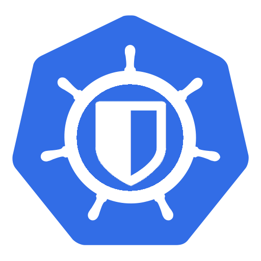

# Bitwarden CRD Operator

[](https://drone.uploadfilter24.eu/lerentis/bitwarden-crd-operator) [](https://artifacthub.io/packages/search?repo=lerentis)

Bitwarden CRD Operator is a kubernetes Operator based on [kopf](https://github.com/nolar/kopf/). The goal is to create kubernetes native secret objects from bitwarden.

<p align="center">
  
</p>

> DISCLAIMER:  
> This project is still very work in progress :)


## Getting started

You will need a `ClientID` and `ClientSecret` ([where to get these](https://bitwarden.com/help/personal-api-key/)) as well as your password.
Expose these to the operator as described in this example:

```yaml
env:
  - name: BW_HOST
    value: "https://bitwarden.your.tld.org"
  - name: BW_CLIENTID
    value: "user.your-client-id"
  - name: BW_CLIENTSECRET
    value: "YoUrCliEntSecRet"
  - name: BW_PASSWORD
    value: "YourSuperSecurePassword"
```

you can also create a secret manually with these information and reference the existing secret like this in the `values.yaml`:

```yaml
externalConfigSecret:
  enabled: true
  name: "my-existing-secret"
```

the helm template will use all environment variables from this secret, so make sure to prepare this secret with the key value pairs as described above.

`BW_HOST` can be omitted if you are using the Bitwarden SaaS offering.

After that it is a basic helm deployment:

```bash
helm repo add bitwarden-operator https://lerentis.github.io/bitwarden-crd-operator
helm repo update 
kubectl create namespace bw-operator
helm upgrade --install --namespace bw-operator -f values.yaml bw-operator bitwarden-operator/bitwarden-crd-operator
```

## BitwardenSecret

And you are set to create your first secret using this operator. For that you need to add a CRD Object like this to your cluster:

```yaml
---
apiVersion: "lerentis.uploadfilter24.eu/v1beta4"
kind: BitwardenSecret
metadata:
  name: name-of-your-management-object
spec:
  content:
    - element:
        secretName: nameOfTheFieldInBitwarden # for example username
        secretRef: nameOfTheKeyInTheSecretToBeCreated 
        secretScope: login # for custom entries on bitwarden use 'fields' 
    - element:
        secretName: nameOfAnotherFieldInBitwarden # for example password
        secretRef: nameOfAnotherKeyInTheSecretToBeCreated 
        secretScope: login # for custom entries on bitwarden use 'fields' 
  id: "A Secret ID from bitwarden"
  name: "Name of the secret to be created"
  namespace: "Namespace of the secret to be created"
```

The ID can be extracted from the browser when you open a item the ID is in the URL. The resulting secret looks something like this:

```yaml
apiVersion: v1
data:
  nameOfTheKeyInTheSecretToBeCreated: "base64 encoded value of TheFieldInBitwarden"
  nameOfAnotherKeyInTheSecretToBeCreated: "base64 encoded value of AnotherFieldInBitwarden"
kind: Secret
metadata:
  annotations:
    managed: bitwarden-secrets.lerentis.uploadfilter24.eu
    managedObject: bw-operator/test
  name: name-of-your-management-object
  namespace: default
type: Opaque
```

## RegistryCredential

For managing registry credentials, or pull secrets, you can create another kind of object to let the operator create these as well for you:

```yaml
---
apiVersion: "lerentis.uploadfilter24.eu/v1beta4"
kind: RegistryCredential
metadata:
  name: name-of-your-management-object
spec:
  usernameRef: nameOfTheFieldInBitwarden # for example username
  passwordRef: nameOfTheFieldInBitwarden # for example password
  registry: "docker.io"
  id: "A Secret ID from bitwarden"
  name: "Name of the secret to be created"
  namespace: "Namespace of the secret to be created"
```

The resulting secret looks something like this:

```yaml
apiVersion: v1
data:
  .dockerconfigjson: "base64 encoded json auth string for your registry"
kind: Secret
metadata:
  annotations:
    managed: bitwarden-secrets.lerentis.uploadfilter24.eu
    managedObject: bw-operator/test
  name: name-of-your-management-object
  namespace: default
type: dockerconfigjson
```

## BitwardenTemplate

One of the more freely defined types that can be used with this operator you can just pass a whole template:

```yaml
---
apiVersion: "lerentis.uploadfilter24.eu/v1beta4"
kind: BitwardenTemplate
metadata:
  name: name-of-your-management-object
spec:
  filename: "Key of the secret to be created"
  name: "Name of the secret to be created"
  namespace: "Namespace of the secret to be created"
  template: |
    ---
    api:
      enabled: True
      key: {{ bitwarden_lookup("A Secret ID from bitwarden", "login or fields", "name of a field in bitwarden") }}
      allowCrossOrigin: false
      apps:
        "some.app.identifier:some_version":
          pubkey: {{ bitwarden_lookup("A Secret ID from bitwarden", "login or fields", "name of a field in bitwarden") }}
          enabled: true
```

This will result in something like the following object:

```yaml
apiVersion: v1
data:
  Key of the secret to be created: "base64 encoded and rendered template with secrets injected directly from bitwarden"
kind: Secret
metadata:
  annotations:
    managed: bitwarden-template.lerentis.uploadfilter24.eu
    managedObject: namespace/name-of-your-management-object
  name: Name of the secret to be created
  namespace: Namespace of the secret to be created
type: Opaque
```

please note that the rendering engine for this template is jinja2, with an addition of a custom `bitwarden_lookup` function, so there are more possibilities to inject here.

## Configurations parameters

The operator uses the bitwarden cli in the background and does not communicate to the api directly. The cli mirrors the credential store locally but doesn't sync it on every get request. Instead it will sync each secret every 15 minutes (900 seconds). You can adjust the interval by setting `BW_SYNC_INTERVAL` in the values. If your secrets update very very frequently, you can force the operator to do a sync before each get by setting `BW_FORCE_SYNC="true"`. You might run into rate limits if you do this too frequent.

Additionally the bitwarden cli session may expire at some time. In order to create a new session, the login command is triggered from time to time. In what interval exactly can be configured with the env `BW_RELOGIN_INTERVAL` which defaults to 3600s.
